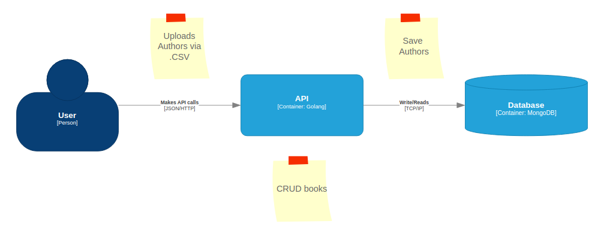

# Olist Challenge - Golang

## Checklist

- [] Receive a CSV with authors and import to database
- [] Expose authors' data in an endpoint
- [] CRUD (Create, Read, Update and Delete) of books

## DiagramArchitecture Diagram

